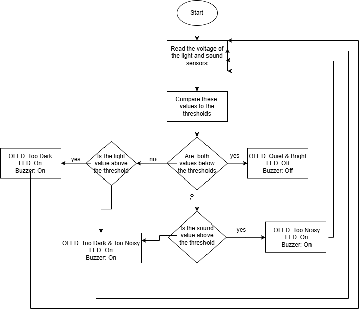

# Quiet Learning Environment Monitor

An embedded environmental monitoring system built with an Arduino Nano 3 and Grove sensors to assess classroom learning conditions based on sound and ambient light levels.

## Overview

The system continuously reads:

- **Sound level** from a Grove sound sensor
- **Ambient light level** from a Grove light sensor

The sensor readings are compared against configurable voltage thresholds. The system then:

1. Classifies the learning environment.
2. Displays the current status on an OLED screen.
3. Activates an LED and buzzer when the environment is too noisy or too dark.
4. Streams sensor readings to MATLAB for live visualization.

## System Architecture and Flow

The system continuously monitors the surrounding environment using
sound and light sensors. Sensor readings are evaluated against
predefined thresholds, and the resulting environmental condition is
displayed through the OLED and communicated through the alert system.



## Video Demonstration

[](https://youtu.be/r-JJpPdLB4c)

[▶ Watch the full demonstration](https://youtu.be/r-JJpPdLB4c)

## Hardware

- Arduino Nano 3 / Grove Beginner Kit
- Grove sound sensor
- Grove light sensor
- Grove OLED display
- LED
- Buzzer

## Pin Configuration

| Component | Arduino Pin |
|---|---|
| Sound sensor | A2 |
| Light sensor | A6 |
| LED | D4 |
| Buzzer | D5 |

## Software

- MATLAB
- MATLAB Support Package for Arduino Hardware
- MATLAB I2C support
- MATLAB Unit Testing Framework

## Repository Structure

```text
quiet-learning-environment-monitor/
├── src/
│   └── main.m
├── tests/
│   └── project_test.m
├── lib/
│   └── matlab-oled-lib/
├── docs/
│   └── project-report.pdf
├── .gitignore
└── README.md
```

## Testing

The project includes MATLAB unit tests for the core decision logic:

- Sound threshold classification
- Light threshold classification
- Combined environment classification

Run the tests using MATLAB's `runtests` command from the project root.

## Running the Project

This project requires physical Arduino/Grove hardware and MATLAB's Arduino support package.

1. Connect the Grove Beginner Kit / Arduino Nano 3.
2. Connect the OLED and required sensors.
3. Update the Arduino COM port in `src/main.m` if necessary.
4. Ensure the MATLAB Arduino Support Package is installed.
5. Add the OLED library directory to the MATLAB path.
6. Run `src/main.m`.

> **Note:** The current implementation expects the Arduino to be available on `COM3`. Change this value in `main.m` if your system uses a different port.

## Design Notes

The project uses threshold-based classification rather than filtering or machine-learning-based detection. Sensor readings are processed continuously and visualized in real time.

## Third-Party Code

The OLED driver functions in `lib/matlab-oled-lib/` were developed by **Aradhya Chawla** and are distributed under the MIT License. The original license is retained in that directory.

## Project Context

This project was developed as an engineering project focused on improving learning environments through embedded sensing and real-time feedback.
